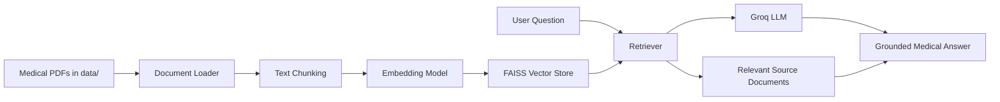

# Medical Chatbot

A powerful medical question-answering assistant built with Retrieval-Augmented Generation (RAG). The project loads medical PDF documents, converts them into searchable vector embeddings, retrieves the most relevant chunks, and answers user questions using a large language model grounded in the provided knowledge base.

This app is designed for safe, document-grounded responses and is especially useful for educational, research, and knowledge-base exploration scenarios where answers should be based on trusted source documents rather than free-form external knowledge.

---

## Overview

The system works in three major stages:

1. Document ingestion: medical PDFs are loaded from the data folder.
2. Embedding and indexing: text is split into chunks and stored in a FAISS vector database.
3. Retrieval + generation: the user asks a question, the app retrieves the most relevant document chunks, and a Groq-hosted LLM generates an answer strictly from the retrieved context.

This is a classic RAG architecture that combines:

- LangChain for orchestration
- FAISS for vector search
- Hugging Face embeddings for semantic matching
- Streamlit for the chatbot interface
- Groq for LLM inference

---

## Why this project matters

Medical information is highly sensitive and context-dependent. This project focuses on grounded answers by limiting the model to information found in the uploaded documents.

The assistant follows rules like:

- answer only from the provided context
- say "I don't know" when information is missing
- avoid making up facts
- remain concise and clinically relevant

This makes it useful as a knowledge assistant for medical resources, institutional documentation, and curated reference material.

---

## Features

- PDF-based knowledge base support
- Semantic retrieval using vector embeddings
- Groq-based chat model integration
- Streamlit web interface
- Source document display for transparency
- Context-grounded medical answer generation
- Simple project structure for learning and expansion

---

## Tech Stack

- Python
- Streamlit
- LangChain
- LangChain Community
- LangChain Groq
- LangChain Hugging Face
- FAISS
- SentenceTransformers
- PyPDF / document loaders
- dotenv for environment variables

---

## Architecture



---

## Project Structure

```text
Medical Chatbot/
├── medibot.py                  # Main Streamlit chatbot app
├── create_memory_for_llm.py    # Creates FAISS index from PDFs
├── create_memory_with_llm.py   # Alternative LLM-backed memory creation script
├── .env                        # Local environment variables (API keys)
├── data/                      # Folder containing medical PDFs
├── vectorstore/
│   └── db_faiss/              # FAISS vector database files
├── README.md                  # Project documentation
└── requirements.txt           # Dependencies (if added later)
```

---

## File Explanation

### 1. medibot.py
This is the main application. It:

- loads the FAISS database
- retrieves relevant chunks for a user query
- builds a prompt with document context
- calls Groq LLM
- returns the answer in the Streamlit UI
- optionally displays source documents used for the answer

### 2. create_memory_for_llm.py
This script prepares the vector database from PDF documents. It:

- reads the PDFs in the data folder
- splits pages into smaller chunks
- converts chunks into embeddings using Hugging Face sentence transformers
- stores them in FAISS for later retrieval

### 3. create_memory_with_llm.py
This is an alternative or experimental script that connects a model with the vector database and creates a QA flow using LangChain retrieval patterns.

---

## How the RAG pipeline works

When a user types a question:

1. The app searches the FAISS vector database for the most relevant document chunks.
2. These chunks become the context for the answer.
3. A prompt is created with:
   - the retrieved context
   - the user question
   - strict instructions to answer only from the context
4. Groq generates a grounded response.
5. The app shows the answer and, when available, the source passages used.

This reduces hallucination and keeps the model faithful to user-provided knowledge.

---

## Setup Instructions

### 1. Clone the repository

```bash
git clone <repository-url>
cd "Medical Chatbot"
```

### 2. Create a virtual environment

```bash
python -m venv venv
```

On Windows:

```bash
venv\Scripts\activate
```

On macOS/Linux:

```bash
source venv/bin/activate
```

### 3. Install dependencies

```bash
pip install streamlit langchain langchain-community langchain-core langchain-groq langchain-huggingface langchain-text-splitters sentence-transformers faiss-cpu python-dotenv pypdf
```

Depending on your environment, some packages may differ slightly, but the project is based on these core dependencies.

### 4. Add your Groq API key
Create a file named .env in the project root:

```env
GROQ_API_KEY=your_groq_api_key_here
```

If you also use Hugging Face endpoints or other models, you may add additional keys as needed.

### 5. Add medical PDFs
Put your PDF documents in the data folder:

```text
data/
  sample-medical-doc.pdf
  another-reference.pdf
```

### 6. Build the vector database
Run the indexing script:

```bash
python create_memory_for_llm.py
```

This creates or updates the FAISS index under:

```text
vectorstore/db_faiss/
```

### 7. Start the chatbot

```bash
streamlit run medibot.py
```

Then open the local URL displayed in the terminal, usually:

```text
http://localhost:8501
```

---

## Using the App

1. Open the Streamlit app in your browser.
2. Type a question about the medical documents in the knowledge base.
3. The app retrieves related document chunks.
4. The LLM answers using only the found evidence.
5. The source documents are displayed for verification.

Example questions:

- What does the document say about hypertension?
- What are the symptoms of a common respiratory condition?
- Explain the treatment recommendation mentioned in the uploaded reference.

---

## Common Issues and Fixes

### 1. ModuleNotFoundError: no module named langchain.chains
This usually happens when the installed LangChain version is newer than the older code pattern. Use the current LangChain 1.x-compatible import style, as shown in the app.

### 2. GROQ_API_KEY is not set
Ensure the .env file exists in the project root with the correct variable name:

```env
GROQ_API_KEY=your_key
```

Then restart the terminal or VS Code session after creating it.

### 3. Model not found error from Groq
Some Groq models are not visible to every account. If you receive a 404 model error, switch to a model name currently available on your Groq API key.

Valid model names depend on your account and plan.

### 4. Vector store not found
Make sure you have run the indexing script before launching the app:

```bash
python create_memory_for_llm.py
```

### 5. Streamlit app not launching
Run it using:

```bash
streamlit run medibot.py
```

Do not run the script directly with Python for the app UI.

---

## Best Practices

- Keep PDFs clean and well-structured.
- Use well-curated medical documents as the source of truth.
- Validate that answers are grounded in retrieved context.
- Prefer a small number of highly relevant chunks for retrieval.
- Test with real clinical documents before production use.

---

## Limitations

This project is meant for document-grounded assistance and learning, not for final clinical diagnosis or treatment decisions. It should not replace medical professional judgment.

Important limitations include:

- document quality depends on source PDFs
- answers are constrained by retrieval results
- model output can still be imperfect even with grounding
- medical knowledge should be validated with authoritative sources

---

## Future Improvements

- Add PDF upload support in the UI
- Add chat history with saved conversations
- Add multilingual query support
- Add filtering for trusted medical sources
- Add document summarization and citation display
- Add user authentication and role-based access
- Improve validation and response safety checks

---

## License

This project is intended for educational and research use. Please check your local licensing requirements before using it in commercial or clinical environments.

---

## Final Note

This project demonstrates a practical and beginner-friendly RAG medical chatbot that combines semantic search, document-grounded generation, and a modern chatbot interface. It is an excellent starting point for anyone learning about AI-powered document Q&A systems.

If you are building on top of this project, the cleanest next steps are:

- add more medical PDFs
- improve prompt engineering
- tune retrieval parameters
- switch to a preferred Groq model
- add user-friendly deployment support

---

## Quick Start Summary

```bash
python -m venv venv
venv\Scripts\activate
pip install streamlit langchain langchain-community langchain-core langchain-groq langchain-huggingface langchain-text-splitters sentence-transformers faiss-cpu python-dotenv pypdf
python create_memory_for_llm.py
streamlit run medibot.py
```

With a .env file like:

```env
GROQ_API_KEY=your_key_here
```

---

If you want, I can also create a more polished version of this README with a project logo section, screenshot placeholders, and a contributor section for GitHub presentation.
